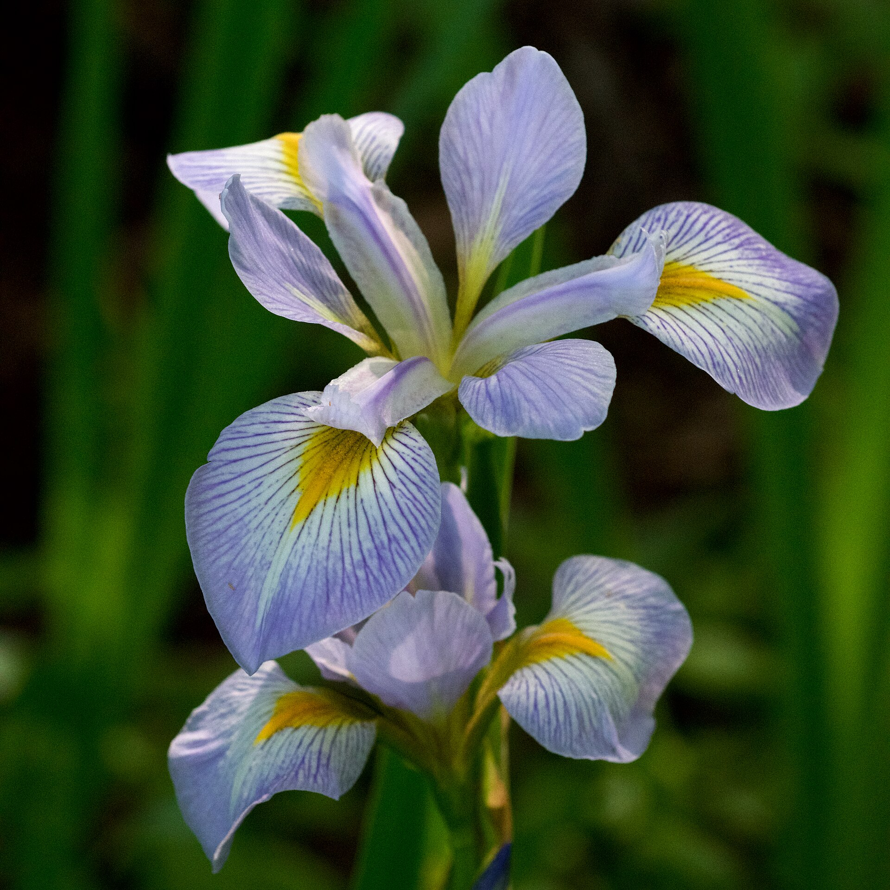

# Proyecto Iris

**Author: Alvaro Zambrana Sejas**

# Descripción

El conjunto de datos de la flor de iris es un conjunto específico de información compilada por el biólogo Ronald Fisher en la década de 1930. Describe características biológicas particulares de varios tipos de flores de iris, específicamente, la longitud y el ancho de los pétalos y los sépalos, que forman parte del sistema reproductivo de la flor.

| Iris Setosa                                                                      | Iris Virginica                                                                 | Iris Versicolor                                                                 |
|----------------------------------------------------------------------------------|--------------------------------------------------------------------------------|---------------------------------------------------------------------------------|
|       |  |  |
| Fuente: [Iris Setosa](https://es.wikipedia.org/wiki/Conjunto_de_datos_flor_iris) | Fuente: [Iris Virginica](https://es.wikipedia.org/wiki/Iris_virginica)         | Fuente: [Iris Versicolor](https://es.wikipedia.org/wiki/Iris_versicolor)        |

